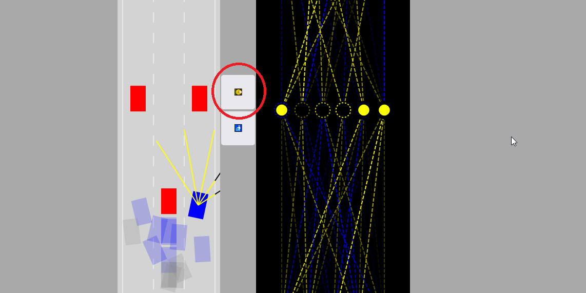
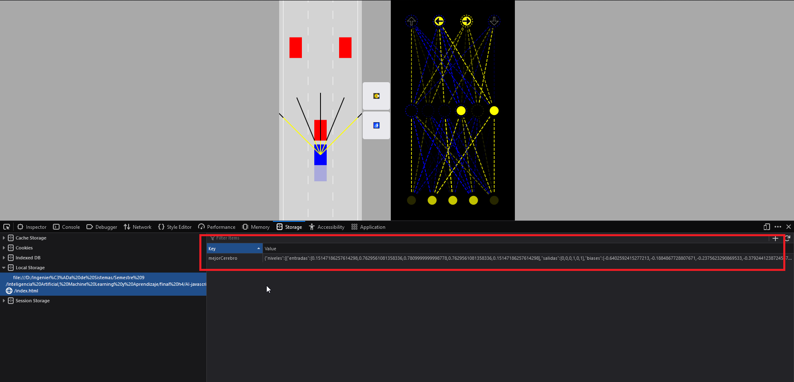

# Despliegue

[REPOSITORIO EN GITHUB DEL PROYECTO](https://github.com/DiegoM2601/AI-javascript)

Al tratarse de un ensayo web sencillo en esencia, el cual solo utiliza JavaScript, HTML y CSS solo basta con abrir el archivo index.html en un navegador web a objeto de ejecutar la simulación. Es importante mencionar que tampoco es necesario que el ordenador se halle conectado a internet, tal y como se mencionó en múltiples ocasiones durante las múltiples presentaciones, el ensayo no está utilizando absolutamente ninguna herramienta externa, librería o Framwork; **todo se ha desarrollado desde cero.**
La simulación se ejecutará ni bien el navegador abra el archivo index.html, a objeto de repetir la simulación y obtener nuevos resultados será necesario recargar la página, esto a través del botón respectivo o a través del comando Ctrl + R dentro del entorno Windows. La interfaz en cuestión cuenta con únicamente 2 botones, cuando una de la simulaciones se halla ejecutado de forma satisfactoria será pertinente pulsar el siguiente botón: 

Esto con el objetivo de almacenar los valores generados por la red neuronal dentro del almacenamiento local del navegador. Habiendo ejecutado dicha operación, si a continuación se procede a recargar la página, la simulación adoptará como referencia esa red neuronal que se acaba de almacenar. Y esto seguirá así hasta que se pulse el botón subyacente el cuál tiene el objetivo de eliminar la red neuronal del almacenamiento local y nuevamente la simulación vuelve a desempeñarse a través de valores aleatorios. 
Después de múltiples intento se ha conseguido una red neuronal que logra desempeñarse de forma correcta esquivando los obstáculos y enderezarse adoptando un nuevo carril de forma automática. La composición de la red neuronal podrá hallarse en el directorio raíz del proyecto con el nombre de mejor-red-neuronal.txt. 
Para implementar la misma será necesario almacenar una simulación al azar en el navegador web a objeto de que la siguiente variable sea visible en las herramientas de desarrollador. 

La variable local fue bautizada con el nombre de "mejorCerebro" y a continuación será necesario abrir el archivo mejor-red-neuronal.txt copiar todo el contenido presente en este archivo y reemplazar el valor de la variable en el navegador. Tras esto será pertinente reiniciar la simulación y la misma empezará a tomar como referencia la red neuronal almacenada localmente. 
